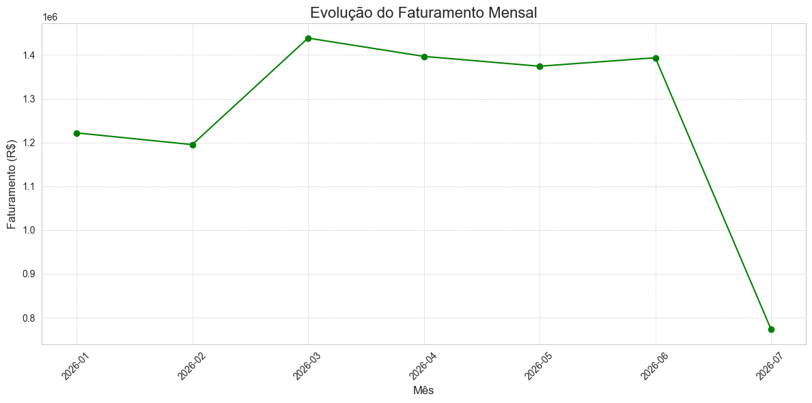
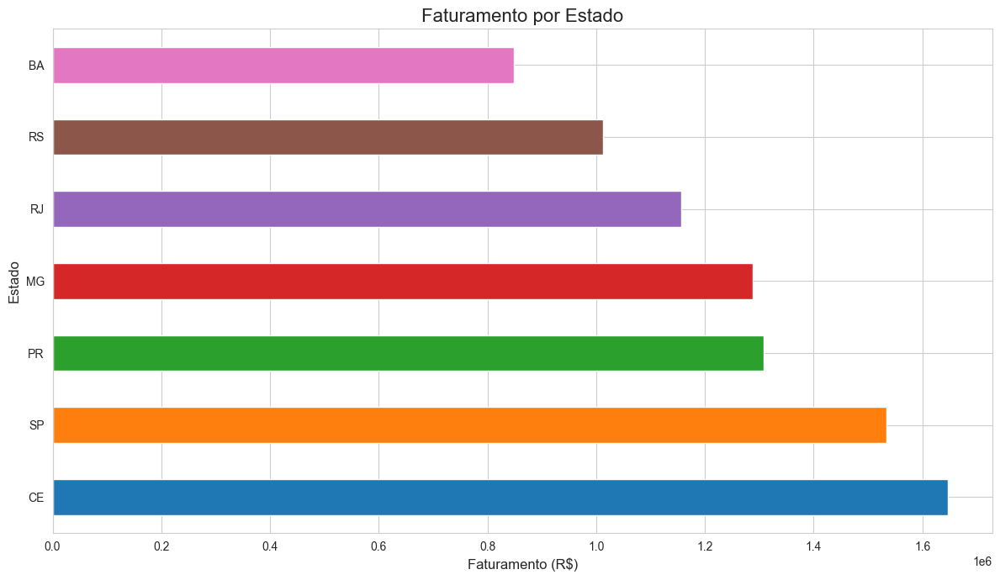
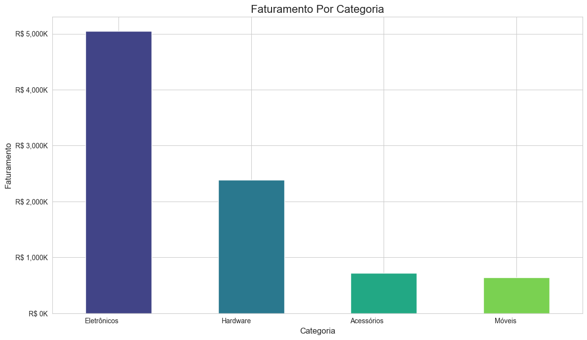

<p align="center">
  
</p>

<h1 align="center">📊✨ Análise de Vendas para E-commerce com Python</h1>
<h3 align="center">Pandas | NumPy | Matplotlib | Seaborn | Data Analytics</h3>

<p align="center">
  
  
  
  
  
  
</p>

---

# 🛒 Sobre o Projeto

Este projeto foi desenvolvido para transformar dados brutos de vendas em **insights reais**, ajudando uma loja de e-commerce em crescimento a tomar decisões mais inteligentes e orientadas por dados.

Utilizei ferramentas essenciais da análise de dados para:

- Consolidar e limpar dados  
- Criar novas variáveis (engenharia de atributos)  
- Explorar padrões de comportamento   
- Construir visualizações intuitivas  
- Responder perguntas críticas de negócio  

---

# 🎯 Problema de Negócio

A empresa enfrentava dificuldades por tomar decisões baseadas em intuição:

- ❌ Estoque desorganizado  
- ❌ Falta de previsibilidade  
- ❌ Marketing pouco efetivo  
- ❌ Expansão sem direção  
- ❌ Pouca compreensão das tendências  

O objetivo é simples:  
> **transformar dados em clareza, clareza em estratégia, e estratégia em crescimento.**

---

# 📌 Objetivos da Análise

### 🔍 **1. O que vender?**  
Produtos mais vendidos e rentáveis.

### 🧭 **2. Onde focar?**  
Categorias que trazem mais faturamento.

### 📆 **3. Quando agir?**  
Tendências mensais e sazonalidade.

### 🗺️ **4. Para onde expandir?**  
Regiões com maior potencial de mercado.

---

# 🛠️ Ferramentas Utilizadas

| Tecnologia | Descrição |
|-----------|-----------|
| **Python** | Linguagem principal |
| **Pandas** | Manipulação de dados |
| **NumPy** | Operações matemáticas |
| **Matplotlib/Seaborn** | Visualizações |
| **Datetime** | Tratamento temporal |
| **Random** | Geração de dados fictícios |

---

# 📊 Visualizações Criadas

### 🏆 Top 10 Produtos Mais Vendidos  


---

### 📈 Evolução do Faturamento Mensal  


---

### 🗺️ Faturamento por Estado  


---

### 🛒 Faturamento por Categoria  


---

# 📂 Estrutura do Projeto

📁 projeto-analise-vendas/
</p> │ 
</p> ├── 📁 imagens/
</p> │ ├── top_10_produtos.png
</p> │ ├── faturamento_mensal.png
</p> │ ├── vendas_por_estado.png
</p> │ └── faturamento_categoria.png
</p> │
</p> ├── 📄 analise_vendas.py
</p> └── 📄 README.md


---

# ▶️ Como Executar

```bash
pip install pandas numpy matplotlib seaborn
python analise_vendas.py
```

👩‍💻 Autora
Maria Eduarda Souza Silva
Zootecnista • Pesquisadora • Data Analyst em formação
💡 Transformando dados em decisões inteligentes
