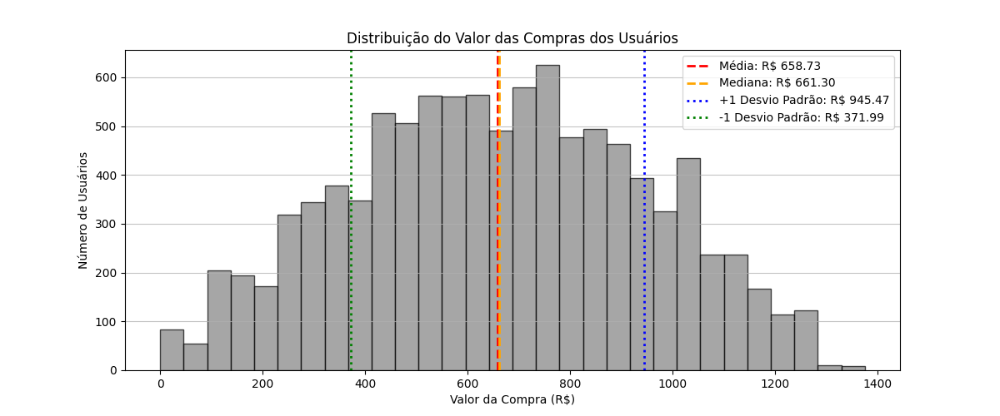

# 📊 Análise Exploratória de Dados – E-commerce

## 📌 Visão Geral do Projeto

Este projeto tem como objetivo realizar uma **Análise Exploratória de Dados (EDA)** em um cenário fictício de e-commerce, utilizando dados simulados de comportamento de usuários. A análise busca gerar **insights de negócio** a partir de métricas de navegação e compra, apoiando decisões estratégicas como segmentação de clientes, aumento de conversão e entendimento do valor gerado por diferentes perfis de usuários.

Os dados representam **10.000 usuários**, cada um descrito por métricas comportamentais e financeiras.

---

## 🎯 Objetivos da Análise

A análise foi estruturada para responder às seguintes perguntas-chave de negócio:

1. Qual é o **perfil médio** do usuário em termos de visitas, tempo no site e valor de compra (ticket médio)?
2. Quais são as **características dos clientes de alto valor** (top 10% em valor de compra)?
3. Qual é o comportamento dos usuários que **visitam o site, mas não realizam compras**?
4. Existe **correlação estatisticamente relevante** entre tempo no site, itens no carrinho e valor final da compra?

---

## 🧱 Estrutura dos Dados

Cada linha do dataset representa um usuário único, com as seguintes variáveis:

| Variável            | Descrição                                   |
| ------------------- | ------------------------------------------- |
| `Visitas`           | Número de visitas ao site                   |
| `TemponoSite(min)`  | Tempo total de navegação no site (minutos)  |
| `ItensnoCarrinho`   | Quantidade de itens adicionados ao carrinho |
| `ValordaCompra(R$)` | Valor final da compra em reais              |

Os dados são **sintéticos**, gerados com correlações intencionais para simular um cenário realista de e-commerce.

---

## 🔍 Etapas da Análise

### 1️⃣ Geração dos Dados

* Criação de um dataset sintético com 10.000 usuários
* Relações lógicas entre variáveis (ex: mais visitas → mais tempo → mais itens no carrinho)

### 2️⃣ Estatísticas Descritivas

* Média, mediana e desvio padrão
* Valores mínimos e máximos
* Análise do ticket médio

### 3️⃣ Análise de Distribuição

* Histograma do valor de compra
* Destaque para média, mediana e desvios padrão

### 4️⃣ Segmentação de Clientes

* Identificação de **clientes de alto valor** (top 10%)
* Comparação entre usuários médios, alto valor e sem compra

### 5️⃣ Análise de Correlação

* Matriz de correlação numérica
* Heatmap para visualização das relações entre variáveis

---

## 📈 Principais Insights

* Existe uma **forte correlação positiva (~0,85)** entre número de itens no carrinho e valor da compra.
* O **tempo no site** apresenta correlação moderada com o valor gasto (~0,6).
* O número de visitas isoladamente possui **baixo impacto direto** no valor da compra.
* Clientes de alto valor visitam mais o site, passam mais tempo navegando e adicionam mais itens ao carrinho.
* Usuários sem compra apresentam baixo engajamento, sugerindo a necessidade de estratégias como remarketing ou melhorias na experiência do usuário.

---

## 📊 Resultados da Análise

### Perfil Geral dos Usuários

* **Visitas médias:** ~25 acessos por usuário
* **Tempo médio no site:** ~32 minutos
* **Itens médios no carrinho:** ~4 itens
* **Ticket médio:** aproximadamente **R$ 140,00**

Esses valores indicam um comportamento de navegação moderado, com potencial de conversão quando o usuário engaja mais profundamente com o site.

### Clientes de Alto Valor (Top 10%)

* **Visitas médias:** ~41
* **Tempo médio no site:** ~40 minutos
* **Itens no carrinho:** ~6 itens
* **Valor de compra significativamente acima da média**

Esse grupo demonstra alto engajamento e maior propensão ao consumo, sendo estratégico para ações de fidelização, programas de benefícios e ofertas personalizadas.

### Usuários Sem Compra

* **Visitas médias:** ~15
* **Tempo médio no site:** ~12 minutos
* **Itens no carrinho:** 0

O baixo nível de interação sugere abandono precoce ou falta de estímulos claros à conversão. Estratégias como melhorias de UX, testes A/B e campanhas de remarketing podem ser exploradas.

### Correlação entre Variáveis

* **Itens no carrinho × Valor da compra:** correlação forte e positiva
* **Tempo no site × Valor da compra:** correlação moderada
* **Visitas × Valor da compra:** correlação fraca

Esses resultados reforçam que **engajamento qualitativo** é mais relevante que quantidade de acessos.

---

## 🚀 Possíveis Extensões do Projeto

* Criação de um **modelo preditivo** para estimar valor de compra
* Clusterização de usuários (K-Means, DBSCAN)
* Análise temporal simulando recorrência de clientes
* Dashboard interativo (Streamlit ou Power BI)

---

## 📄 Observação

Este projeto foi desenvolvido com fins **educacionais e demonstrativos**, simulando um fluxo real de análise de dados aplicado a negócios digitais.

---

## 🛠️ Tecnologias Utilizadas

---

**Autora:** Maria Eduarda Souza Silva
**Área:** Ciência de Dados | Análise de Dados | E-commerce
